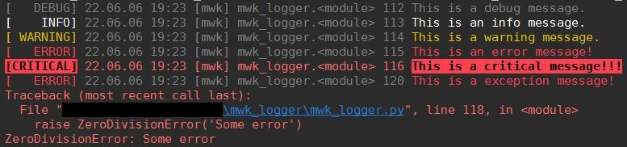

# MWK logger

---

**Custom logger with colors on terminal.**  



---

###Using logger:  
***1. Get instance of mwk-logger:*** (example)
```python
from mwk_logger.logger import MwkLogger

log = MwkLogger(name='mwk',
                file='logger.log',
                stream_level='DEBUG',
                file_level='DEBUG',
                time=True).logger
```
>*!!! Remember to add* ***.logger*** *at the end !!!*   

*keyword parameters:*  
- *name* - name of the logger, by default = 'mwk',
- *file* - path to file to log into, by default = 'mwk.log',
- *stream_level* - logging level for terminal, by default = 'WARNING',
- *file_level* - logging level for file, by default = None,
- *time* - if timestamp should be added to terminal log, by default = False,

LEVELS:
 **None** - no logging (terminal or file) or:  
 '**DEBUG**', '**INFO**', '**WARNING**', '**ERROR**', '**CRITICAL**'.  
If both levels are set to **None** stream_level is changed to **WARNING**.  
Timestamp is by default added to file logs. One can set if timestamp will be added to terminal logs.  

***2. Logging:***  
```python
log.debug('This is a debug message.')
log.info('This is an info message.')
log.warning('This is a warning message.')
log.error('This is an error message!')
log.critical('This is a critical message!!!')
log.exception('This is an exception message!')
```